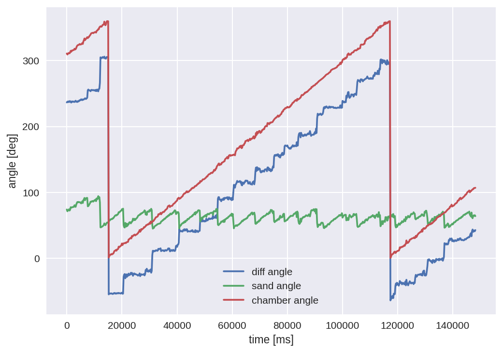
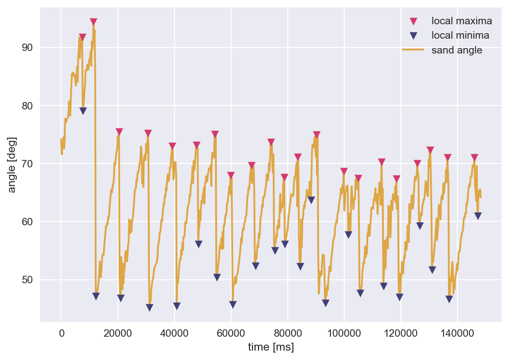

# SandVision

SandVision aims to automate the analysis of video-recordings of sand-behavior within a rotating chamber.
Specifically, it aims to detect the chamber-rotating-angle and the sand-surface-angle relatively
to the cartesian coordinate system by a UNET-inspired machine learning model.
This allows the calculation of the sand-slide timepoint and the maximal tilt angle of the sand until instability.

<br />


<br />

## Download
```bash
# fedora --> python3.13 is recommended for the project
sudo yum install python3.13
git clone https://github.com/feiler98/SandVision

# install requirements in project directory
sudo yum install ffmpeg
sudo yum install -r requirements.txt
```
It is recommended to use the program in combination with PyCharm or as Docker application (see Dockerfile).

<br />

## Usage
- training of the model: **script_train_img_seg_ml.py**
- prediction of image-sequence data: **script.py**

<br />

## Predictive-Performance 
Cumulative 3-fold cross validation with ~30,000 images generated from 79 original images
<table>
    <tr>
        <th>mask</th>
        <th>pixel accuracy</th>
        <th>dice score</th>
    </tr>
    <tr>
        <td>circle-chamber</td>
        <td>99.45 %</td>
        <td>98.87 %</td>
    </tr>
    <tr>
        <td>white-dot-marker</td>
        <td>99.99 %</td>
        <td>98.34 %</td>
    </tr>
    <tr>
        <td>sand</td>
        <td>99.72 %</td>
        <td>98.76 %</td>
    </tr>
</table>

<br />

3-fold cross validation with ~30,000 images generated from 79 original images <br /> (model retrain for each cross validation)
<table>
    <tr>
        <th>mask</th>
        <th>pixel accuracy</th>
        <th>dice score</th>
    </tr>
    <tr>
        <td>circle-chamber</td>
        <td>98.90±0.33 %</td>
        <td>97.74±0.67 %</td>
    </tr>
    <tr>
        <td>white-dot-marker</td>
        <td>99.97±0.00 %</td>
        <td>96.10±0.48 %</td>
    </tr>
    <tr>
        <td>sand</td>
        <td>99.43±0.10 %</td>
        <td>97.57±0.41 %</td>
    </tr>
</table>

<br />

## Example Results | Sample 'W3-6400-3200-nr25'
<br />


<br />



<br />
sand properties<br />
---------------<br />
    avg: 71.31±0.64 deg<br />
    min: 67.38 deg<br />
    max: 75.49 deg<br />

<br />

## Authorship
**W. Feiler** | construction of data processing and machine learning pipeline  <br />
**R. Lößlein** | data production and image masking for ML-training
<br />
<br />
Credits to Aladdin Persson for his UNET implementation | https://www.youtube.com/@AladdinPersson
<br />
<br />
Usage of the program is allowed with credits to the authors. 
<br />
Please read through the LICENSE for further information in regard to download, usage, and distribution of the software.

<br />

## Data / Model Availability
Training data and models are not included in the repository and are only provided upon request.